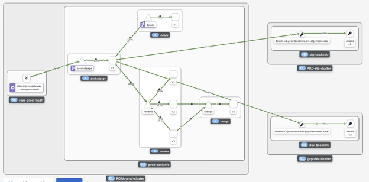

# Connecting the Clouds

## Toward a True hybrid/multi-cloud by OSSM federation

In this blog, we will discuss different aspects of multi-cloud and multi-cluster Kubernetes strategies. We will show how you can build Hybrid/multi-cloud architectures with Red Hat OpenShift and OpenShift Service Mesh(OSSM) federation




## Multi/Hybrid Cloud Strategy

Teams within an organization may have different requirements, workloads, and preferences and may naturally gravitate towards using a specific cloud platform. This can lead to a fragmented cloud landscape, with different teams using different cloud platforms. In such cases, a multi-cloud strategy can help to bring consistency and coherence to the organization's cloud deployment while allowing teams to continue using the cloud platform that best meets their needs.

Many enterprises choose a multi-cloud strategy for several reasons, including vendor diversification, cost optimization, and reducing dependence on a single provider. This allows them to take advantage of the strengths of different cloud platforms and avoid vendor lock-in. Multi-cloud is becoming increasingly popular as enterprises seek to balance their workloads across multiple environments to maximize efficiency, performance, and cost savings.

### Pros:

Enterprise customers are choosing a multi-cloud strategy for several reasons:

1.  **Scalability:** Kubernetes makes it easy to scale applications across multiple clusters, which can help to accommodate growth and handle spikes in demand. Customers may need to deploy their applications across multiple clusters to handle growing traffic. i.e., Having multiple clusters in different regions can provide additional resources to scale out applications and services as needed

1.  **High availability:** Multi-cluster Kubernetes environments can provide improved availability and resiliency, as applications can be deployed across multiple clusters for redundancy. i.e., Having multiple clusters in different regions helps to ensure the high availability of applications and services by providing redundancy in the event of a failure in one region.

1.  **Portability:** Kubernetes provides a consistent, platform-agnostic environment for deploying and managing applications, making it easier to move applications between different clusters and cloud platforms.

1.  **Performance:** By deploying applications across multiple clusters, organizations can take advantage of the resources of multiple cloud platforms, which can result in improved performance and efficiency. i.e., Running applications and services in different regions can help to reduce latency for users by providing them with a closer, geographically-located instance.

1.  **Cost optimization:** By using multiple clusters, organizations can optimize costs by choosing the best cloud platform for each workload, and by utilizing resources more effectively across multiple clusters.Running applications and services in multiple regions can help to reduce costs by taking advantage of lower-cost areas for some components and higher-cost areas for others.i.e., Customers can save cost by utilizing excess capacity in other clusters during periods of low utilization rather than provisioning additional resources in a single cluster

1. **Compliance & security:** Certain regions may have specific data privacy regulations that need to be adhered to, requiring applications and services to be hosted in those regions.

1. **Vendor lock-in:** By not relying on a single cloud provider, organizations can reduce their dependence on a single vendor, which can help to mitigate the risk of vendor lock-in.

1. **Burstable workloads:** Customers can handle unexpected spikes in traffic or workloads by dynamically allocating resources across multiple clusters, allowing them to scale their infrastructure on demand.

Overall, multi-cluster Kubernetes environments provide organizations with greater

flexibility, scalability, and control over their applications and infrastructure.

However, it's important to note that multi-cluster Kubernetes environments can

be complex and challenging to manage and require a significant investment in time, resources, and expertise.

## Cons:

1.  **Complexity:** Multi-cloud can be complex to manage, with multiple cloud environments to maintain and multiple points of failure to consider.

1.  **Interoperability:** There may be compatibility and interoperability issues between different cloud platforms, which can create additional work for IT teams.

1.  **Cost:** Implementing and maintaining a multi-cloud strategy can be more expensive than a single-cloud strategy due to the additional resources and expertise required.

1.  **Management overhead:** Managing multiple cloud environments can be more time-consuming and resource-intensive than managing a single environment.

1.  **Lack of uniformity:** With multiple cloud platforms, it can be more challenging to ensure consistency and uniformity across different environments.

In conclusion, multi-cloud has its own set of pros and cons, and the best approach

will depend on the specific needs and goals of each organization. A well-executed multi-cloud strategy can provide organizations with greater flexibility, cost optimization, and reduced vendor dependence but requires careful planning and management to be successful.

Multi-cloud and multi-cluster Kubernetes strategies will continue to gain popularity in the future. It is reasonable if we assume that multi-cloud and multi-cluster Kubernetes strategies will continue to gain popularity in the future.
## Application architecture for multi-cloud

There are several methods to architect an application on multiple Kubernetes clusters, The two common app architectures in multi-cluster Kubernetes environments are:

1.  Split architecture: Different components of an application are deployed to different clusters based on factors such as resource requirements, scaling needs, security, data locality and other factors. This enables better resource utilization and isolation of different parts of the Application.
    
1.  Replicated: This involves deploying identical copies of the application across multiple clusters, each serving a specific geographic region or customer base, providing high availability and disaster recovery capabilities.

Red Hat OpenShift is a comprehensive and scalable application platform for deploying and managing applications in Kubernetes clusters, including support for hybrid and multi-cloud environments. It provides a consistent development and deployment environment, as well as enterprise-grade security and manageability features.
1.  Scalability: OpenShift provides a scalable and flexible platform for deploying and managing applications, making it easier for organizations to scale up and down as needed.
    
1.  Improved security: OpenShift includes built-in security features and integrations with various security tools, which can help organizations to secure their applications and data in the cloud.
    
1.  Increased efficiency: OpenShift provides a consistent environment for development, testing, and production, which can help organizations to streamline their processes and increase efficiency.
    
1.  Hybrid and multi-cloud support: OpenShift supports multiple clouds, including on-premises, private cloud, and public cloud environments, making it easier for organizations to adopt a hybrid or multi-cloud strategy.
    
1.  Ease of integration: OpenShift provides a common platform for integrating with various tools and technologies, which can help organizations to simplify their processes and increase collaboration.
    
1.  Enterprise-grade features: OpenShift includes features and support for enterprise-grade applications, such as high availability, disaster recovery, and scalability, which can help organizations to meet the demands of their business-critical applications.
    
## Connecting clusters

In general, we can categorize connection strategy into two high-level categories:

1.  **CNI-oriented model:** The CNI-oriented (Container Network Interface) model acts at the network layer, connecting overlay networks together. This model leverages the CNI plug-in architecture of Kubernetes to provide network connectivity between nodes in different clusters.
    

This typically involves deploying a CNI plugin, such as OVN, Flannel, Calico, or Cilium, in each cluster and configuring the plugin to establish connectivity between the clusters.

The CNI plug-in provides a low-level, flexible approach to connecting the overlay networks and can support a variety of network topologies, including mesh and hub-and-spoke.

1.  **CNI-agnostic model:** The CNI-agnostic model acts at the controller layer, connecting Kubernetes clusters through a central control plane. This model does not rely on the CNI plug-in architecture and instead uses a higher-level API to provide network connectivity between nodes in different clusters. The central control plane provides a unified view of the network and can be used to manage network policies, monitor network performance, and provide security services such as encryption and firewalling.
    
![(https://lh5.googleusercontent.com/iVlDcw-CSjWUa8BOBJRAwMzjz4efaeJPbCsrfo3M0Jovq8dYKOwYYMrJHn5ikoov5-Cdb7uC3jD0ccZPhippjawgfwalt3lHvU-DTXpYO-hgusZ15WTdw3UvAzlblXT3msieTuBq7P4TYisra5yL2Ts)

## Choose a solution

Ranking the solutions for connecting multiple Kubernetes clusters depends on the specific requirements and trade-offs of each customer. However, in general, the preferred solution for a customer would be the one that best meets their needs in terms of:

1.  **Functionality:** Does the solution provide the required level of functionality for the customer's use case, such as service discovery, network management, security, performance, etc?
    
1.  **Scalability:** Can the solution scale to meet the customer's growing needs as their infrastructure grows?
    
1.  **Ease-of-use:** How easy is it for the customer to deploy, manage, and maintain the solution?
    
1.  **Cost:** How cost-effective is the solution for the customer, taking into account both upfront and ongoing costs?

Based on these factors, a customer may prefer one solution over another. For example, a customer with a need for advanced network management and security may prefer a service mesh solution, while a customer with a need for simple, cost-effective network connectivity may prefer a VPN or VPC peering solution.

As a general recommendation, I would suggest that most customers look at a service mesh solution as the first option for connecting multiple Kubernetes clusters. Service mesh can indeed be a preferred method for connecting multiple Kubernetes clusters, as it abstracts the network complexity and provides a number of benefits. Service mesh solutions such as OpenShift Service Mesh, Istio, Linkerd, and Consul Connect provide a high level of functionality, scalability, and ease of use for communication between services across multiple clusters and can meet the needs of many customers. Service mesh can:

1.  **Automate Network Management:** Service Mesh provides automatic traffic management and routing between services in different clusters, reducing the complexity of manual network configuration and management.
    
1.  **Improve Security:** Service Mesh provides service-to-service encryption and authentication, improving security and privacy for communication between services across clusters.
    
1.  **Optimize Performance:** Service Mesh provides intelligent traffic routing and load balancing, helping to improve the performance of applications by reducing latency and increasing reliability.
    

However, it's worth noting that service mesh also has some potential drawbacks, including increased operational complexity and the potential for increased resource utilization and latency due to proxy overhead. The right solution for a particular use case will depend on the specific requirements and trade-offs involved.


However, it is important to keep in mind that a service mesh solution may not be the best fit for every customer, and that the specific requirements and trade-offs of each customer should be taken into account when choosing the best solution. In cases where a service mesh is not the best fit, VPN or VPC peering solutions may provide a simpler, more cost-effective option for network connectivity between clusters.

### OpenShift Service Mesh Federation in action

For this post, we’ll use three different cloud providers, but you can run it on two clusters in the same cloud or a different one.

#### Prerequisites

In this blog, we use public clusters, but in a production environment, it is highly recommended to use private clusters.

  - ROSA (Red Hat Openshift Service on AWS) cluster
  - ARO (Azure Red Hat OpenShift) cluster
  - ROG (Red Hat OpenShift Dedicated on GCP) cluster
  
**Note:** We use three contexts with the following name in the scripts:
  - rosa : to access to ROSA cluster   
  - aro: to access to ARO cluster
  - rog: to access to GCP cluster

#### Deploy OpenShift Service Mesh on all clusters

Installing the OSSM(OpenShift Service Mesh) involves installing the OpenShift Elasticsearch, Jaeger, Kiali, and Service Mesh Operators, creating and managing a ServiceMeshControlPlane resource to deploy the control plane, and creating a ServiceMeshMemberRoll resource to specify the namespaces associated with the Service Mesh
1. Clone the repository
    ```bash
    Git clone https://github.com/houshym/ossm-fed.git
    ```

1. Install service mesh operators on each cluster by applying this [manifest](https://github.com/houshym/ossm-fed/blob/main/ossm-operator/ossm.yaml) on each cluster or use the following snippet

    ```bash
        cat << EOF | oc apply -f -
        # installing elastic search operator
        #Create a Subscription to subscribe the openshift-operators namespace 
        # to the OpenShift Elasticsearch Operator
        apiVersion: operators.coreos.com/v1alpha1
        kind: Subscription
        metadata:
          name: elasticsearch-operator
          namespace: openshift-operators
        spec:
          channel: "stable"
          name: elasticsearch-operator
          source: redhat-operators
          sourceNamespace: openshift-marketplace
          installPlanApproval: Automatic
        ---
        #install jaeger operator
        apiVersion: operators.coreos.com/v1alpha1
        kind: Subscription
        metadata:
          name: jaeger-product
          namespace: openshift-operators
        spec:
          name: jaeger-product
          source: redhat-operators
          sourceNamespace: openshift-marketplace
          channel: "stable"
          installPlanApproval: Automatic
        --- 
        #intsall Kiali operator
        apiVersion: operators.coreos.com/v1alpha1
        kind: Subscription
        metadata:
          name: kiali-ossm
          namespace: openshift-operators
        spec:
          name: kiali-ossm
          source: redhat-operators
          sourceNamespace: openshift-marketplace
          channel: "stable"
          installPlanApproval: Automatic
        --- 
        # Create a Subscription  to subscribe the openshift-operators
        # namespace to the Red Hat OpenShift Service Mesh Operator
        apiVersion: operators.coreos.com/v1alpha1
        kind: Subscription
        metadata:
          name: servicemeshoperator
          namespace: openshift-operators
        spec:
          channel: "stable"
          name: servicemeshoperator
          source: redhat-operators
          sourceNamespace: openshift-marketplace
          installPlanApproval: Automatic
        ---
        EOF
    ```
2. Check operators status. if you need troubleshooting follow the [troubleshooting operator](https://docs.openshift.com/container-platform/4.12/support/troubleshooting/troubleshooting-operator-issues.html) with the following command:   
    ```bash
    oc describe sub elasticsearch-operator -n openshift-operators
    oc describe sub jaeger-product -n openshift-operators
    oc describe sub kiali-ossm -n openshift-operators
    oc describe sub servicemeshoperator -n openshift-operators
    ``` 
    **or run the following script**
    ```bash
    #!/bin/bash
    get_message() {
    operator=$1
    namespace=$2
    message=$(oc describe sub "$operator" -n "$namespace" | yq '.Status.Conditions.Message')
    echo "Operator: $operator"
    echo "Message: $message"
    echo
    }
    operators=("elasticsearch-operator" "jaeger-product" "kiali-ossm" "servicemeshoperator")
    namespaces=("openshift-operators-redhat" "openshift-distributed-tracing" "openshift-operators" "openshift-operators")
    for ((i=0; i<${#operators[@]}; i++)); do
    operator="${operators[$i]}"
    namespace="${namespaces[$i]}"
    get_message "$operator" "$namespace"
    done
    ```
3. create service mesh
    **Note:** you can use this [script](https://github.com/houshym/ossm-fed/blob/main/ossm-operator/ossm.yaml) to dploy a service mesh instance and create a federation between ROSA and ARO cluster.
    **ROSA cluster**
    ```bash
    oc config use-context rosa
    oc new-project rosa-prod-mesh
    oc new-project prod-bookinfo
    oc apply -f rosa-prod/smcp.yaml
    oc apply -f rosa-prod/smmr.yaml
    ```
    **ARO cluster**
    ```bash
    oc config use-context aro
    ​oc new-project aro-stg-mesh
    oc new-project stg-bookinfo
    oc apply -f aro-stg/smcp.yaml
    oc apply -f aro-stg/smmr.yaml
    ```
    **Check service mesh instance is up and running**
    ```bash
    oc config use-context rosa
    log "Waiting for rosa-prod-mesh installation to complete"
    oc wait --for condition=Ready -n rosa-prod-mesh smmr/default --timeout 300s
    oc config use-context aro
    log "Waiting for aro-stg-mesh installation to complete"
    oc wait --for condition=Ready -n aro-stg-mesh smmr/default --timeout 300s
    ```
### Deploy application on ROSA cluster
    ```bash
    oc config use-context rosa
    log "Installing bookinfo application in rosa-prod-mesh"
    oc apply -n prod-bookinfo -f https://raw.githubusercontent.com/Maistra/istio/maistra-2.0/samples/bookinfo/platform/kube/bookinfo.yaml
    oc apply -n prod-bookinfo -f https://raw.githubusercontent.com/Maistra/istio/maistra-2.0/samples/bookinfo/networking/bookinfo-gateway.yaml
    oc apply -n prod-bookinfo -f https://raw.githubusercontent.com/Maistra/istio/maistra-2.0/samples/bookinfo/networking/destination-rule-all.yaml
    ```  

### Deploy application on ARO cluster
    ```bash
    oc config use-context aro
    oc apply -f aro-stg/stage-detail-v2-deployment.yaml
    oc apply -f aro-stg/stage-detail-v2-service.yaml
    ```
### Create Federation between ARO and ROSA
1. Retrieving ROSA Istio CA Root certificates    
    ```bash
    oc config use-context rosa
    ROSA_PROD_MESH_CERT=$(oc get configmap -n rosa-prod-mesh istio-ca-root-cert -o jsonpath='{.data.root-cert\.pem}' | gsed ':a;N;$!ba;s/\n/\\\n /g')
    ```
1. Retrieving ARO Istio CA Root certificates
    ```bash
    oc config use-context aro
    ARO_STG_MESH_CERT=$(oc get configmap -n aro-stg-mesh istio-ca-root-cert -o jsonpath='{.data.root-cert\.pem}' | gsed ':a;N;$!ba;s/\n/\\\n /g')
    #STAGE_MESH_CERT=$(echo "$STAGE_MESH_CERT" | tr -d '\n')
    ```
1. Enabling federation for rosa-prod-mesh
    ```bash
    oc config use-context rosa
    log "Enabling federation for rosa-prod-mesh"
    gsed "s:{{ARO_STG_MESH_CERT}}:$ARO_STG_MESH_CERT:g" rosa-prod/aro-stg-mesh-ca-root-cert.yaml | oc apply -f -
    oc apply -f rosa-prod/smp-aro.yaml
    oc apply -f rosa-prod/iss-aro.yaml
    ```
1. Enabling Federation for aro-stg-mesh
    ```bash
    oc config use-context aro
    log "Enabling federation for aro-stg-mesh"
    gsed "s:{{ROSA_PROD_MESH_CERT}}:$ROSA_PROD_MESH_CERT:g" aro-stg/rosa-prod-mesh-ca-root-cert.yaml | oc apply -f -
    oc apply -f aro-stg/smp.yaml
    oc apply -f aro-stg/ess.yaml
    ```    
1. Config VirtualService for rosa-prod-mesh
    ```bash
    oc config use-context rosa
    log "Installing VirtualService for rosa-prod-mesh"
    oc apply -n prod-bookinfo -f rosa-prod/vs-mirror-details.yaml
    ```    
1. Check federation status
    ```bash
    oc -n rosa-prod-mesh get servicemeshpeer aro-stg-mesh -o json | jq .status
    ```   
1. Check connection status on aro-stg-mesh
    ```bash
    oc -n aro-stg-mesh get servicemeshpeer rosa-prod-mesh -o json | jq .status
    ``` 
1. check service imported to into rosa-prod-mesh
    ```bash
    oc -n rosa-prod-mesh get importedservicesets aro-stg-mesh -o json | jq .status
    ```
check if services from aro-stg-mesh are exported

```bash
oc -n aro-stg-mesh get exportedservicesets rosa-prod-mesh -o json | jq .status
```
### Create federation between ROSA and ROG
    
1. Create a service mesh instance on ROG
```bash
 oc config use-context rog
 oc new-project gcp-dev-mesh
 oc new-project dev-bookinfo
 oc apply -f gcp-dev/smcp.yaml
 oc apply -f gcp-dev/smmr.yaml
```
1. Check mesh instance is up and running
   
```bash
 oc config use-context rosa
 log "Waiting for rosa-prod-mesh installation to complete"
 oc wait --for condition=Ready -n rosa-prod-mesh smmr/default --timeout 300s
 oc config use-context rog
 log "Waiting for gcp-dev-mesh installation to complete"
 oc wait --for condition=Ready -n gcp-dev-mesh smmr/default --timeout 30
```
1. Install application on ROG cluster 
```bash
oc apply -f gcp-dev/dev-detail-v3-deployment.yaml
oc apply -f gcp-dev/dev-detail-v3-service.yaml
``` 
1. Create Federtion between ROSA and ROG
     **Retrieving ROSA Istio CA Root certificates**
    
```bash
 oc config use-context rosa
 ROSA_PROD_MESH_CERT=$(oc get configmap -n rosa-prod-mesh istio-ca-root-cert -o jsonpath='{.data.root-cert\.pem}' | gsed ':a;N;$!ba;s/\n/\\\n /g')
 #PROD_MESH_CERT=$(echo "$PROD_MESH_CERT" | tr -d '\n')
```
  **Retrieving ROSA Istio CA Root certificates**

 ```bash
 oc config use-context rog
 GCP_DEV_MESH_CERT=$(oc get configmap -n gcp-dev-mesh istio-ca-root-cert -o jsonpath='{.data.root-cert\.pem}' | gsed ':a;N;$!ba;s/\n/\\\n /g')
 #STAGE_MESH_CERT=$(echo "$STAGE_MESH_CERT" | tr -d '\n')
 
 gsed "s:{{GCP_DEV_MESH_CERT}}:$GCP_DEV_MESH_CERT:g" rosa-prod/gcp-dev-mesh-ca-root-cert.yaml | oc apply -f -
 oc apply -f rosa-prod/smp-gcp.yaml
 oc apply -f rosa-prod/iss-gcp.yaml
 oc config use-context rog
 gsed "s:{{ROSA_PROD_MESH_CERT}}:$ROSA_PROD_MESH_CERT:g" gcp-dev/rosa-prod-mesh-ca-root-cert.yaml | oc apply -f -
 oc apply -f gcp-dev/smp.yaml
 oc apply -f gcp-dev/ess.yaml
```

1. Check federation and import status on ROSA
```bash
oc config use-context rosa
oc -n rosa-prod-mesh get servicemeshpeer gcp-dev-mesh -o json | jq .status
oc -n rosa-prod-mesh get importedservicesets gcp-dev-mesh -o json | jq .status
```  

1. Check federation and export status on ROG
```bash
oc config use-context rog
oc -n gcp-dev-mesh get servicemeshpeer rosa-prod-mesh -o json | jq .status
oc -n gcp-dev-mesh get exportedservicesets rosa-prod-mesh -o json | jq .status
```
  
 ## federation in action
To see , create some load in the bookinfo app in rosa-prod-mesh. For example:
```bash
BOOKINFO_URL=$(oc -n rosa-prod-mesh get route istio-ingressgateway -o json | jq -r .spec.host)
while true; do sleep 1; curl http://${BOOKINFO_URL}/productpage &> /dev/null; done
```

open Kiali console and check the graph